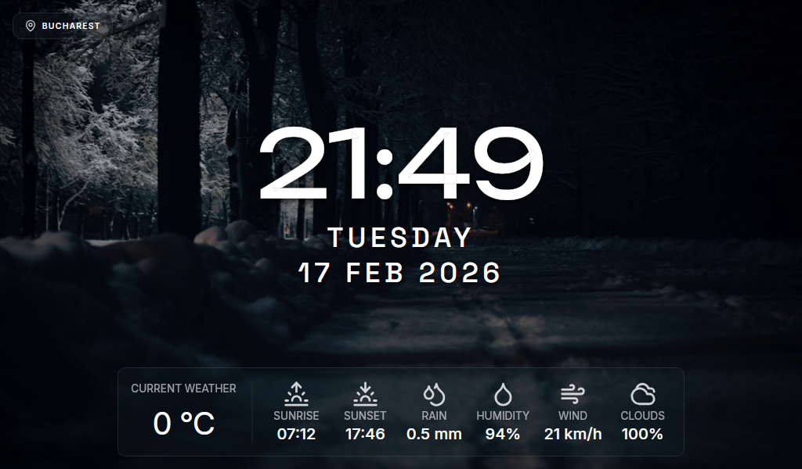

# Idleview



A beautiful, fullscreen dashboard application built with Tauri that displays the time, date, weather, and stunning contextual background images from Unsplash. Perfect for Raspberry Pi displays, smart mirrors, or any always-on display setup.

## ✨ Features

###  **Smart Background Images**
- **Seasonal Awareness**: Automatically adjusts photos based on spring, summer, autumn, or winter
- **Holiday Themes**: Special imagery for Christmas, New Year, Halloween, and Easter
- **Time-Based Moods**: 
  - Dawn: Moody, atmospheric sunrise photos
  - Day: Bright, vibrant landscapes
  - Dusk: Golden hour, sunset vibes
  - Night: Dark, moody nightscapes
- **Weather Integration**: Shows cozy rain or snow photos when it's raining or snowing
- **Powered by Unsplash**: High-quality, curated photography

### **HTTP Server & Remote Control**
- **Built-in REST API**: Control your display remotely via HTTP endpoints
- **Web Control Panel**: Modern, responsive interface for settings management
- **Network Access**: Configure settings from any device on your local network (phone, tablet, laptop)
- **Real-time Updates**: Changes apply instantly without restarting the app
- **Cross-platform Settings**: Platform-specific configuration storage (Windows/macOS/Linux)

### **Real-Time Information Display**
- **Live Clock**: Updates every second with configurable 12h/24h format
- **Current Date**: Clean, readable date display with multiple format options (MDY/DMY/YMD)
- **Local Weather**: Real-time temperature with support for Celsius or Fahrenheit
- **Wind Speed**: Display in km/h, mph, or m/s
- **Weather Details**: Optional humidity, wind, precipitation, and cloudiness information
- **Sunrise/Sunset Times**: When enabled, shows daily sun schedule
- **Auto-Location**: Automatically detects your location via IP geolocation

### **Performance & Compatibility**
- **Cross-Platform**: Windows, macOS, Linux (including ARM for Raspberry Pi)
- **Minimal Resource Usage**: Built with Tauri for native performance
- **Efficient Backend**: Rust-powered API calls and data processing
- **Lightweight HTTP Server**: Axum-based server with minimal overhead
- **Fullscreen Mode**: Immersive, distraction-free display

## 🛠️ Technologies

- **[Tauri v2](https://tauri.app/)**: Cross-platform desktop framework
- **Rust**: Backend logic and API integration
- **[Axum](https://docs.rs/axum/)**: High-performance HTTP server framework
- **[Tokio](https://tokio.rs/)**: Asynchronous runtime
- **JavaScript/HTML/CSS**: Frontend display
- **Vue.js** : Web control panel UI

### **External APIs**
- **[Unsplash API](https://unsplash.com/developers)**: High-quality background images
- **[Open-Meteo](https://open-meteo.com/)**: Free weather data API
- **[IP-API](http://ip-api.com/)**: IP-based geolocation


### **Access from Network**

Once running, you can access the control panel from any device on your local network:

```
http://192.168.XXX.XXX:8737
```

Replace `XXX` with your device IP address.

---